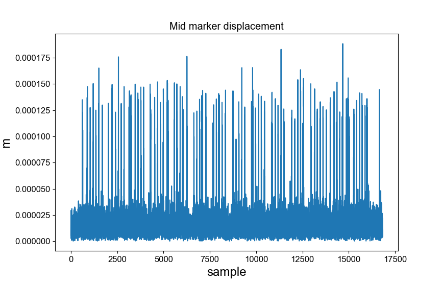

## Step motor modelling

Vibration problem

Sensed speeds by using mocap system. 

| Expected Angular Vel(deg/sec) | Sensed Angular Vel(deg/sec) | Sensed Path Taken(mm) | Error (deg/sec)
| -------- | ------- | ------- | ------- |
| 36  | 36.7  | 23.05 | 0.70 |
| 45  | 45.93  | 28.85 | 0.93 |
| 90  | 91.72  | 57.56 | 1.72 |
| 126  | 128.38  | 80.66 | 2.38 |
| 144  | 146.73  | 92.19 | 2.73 |
| 180  | 183.45  | 115.26 | 3.45 |
